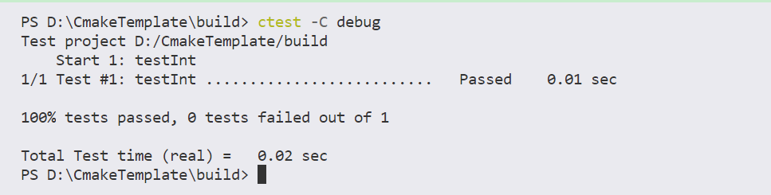
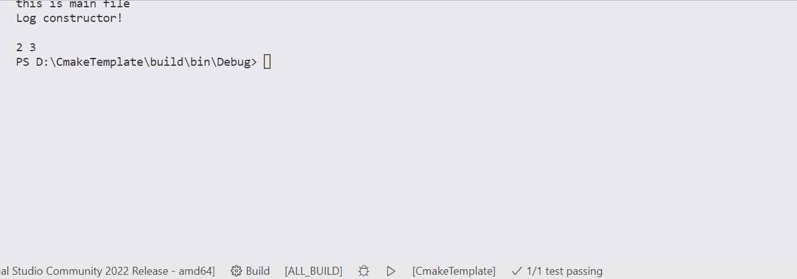
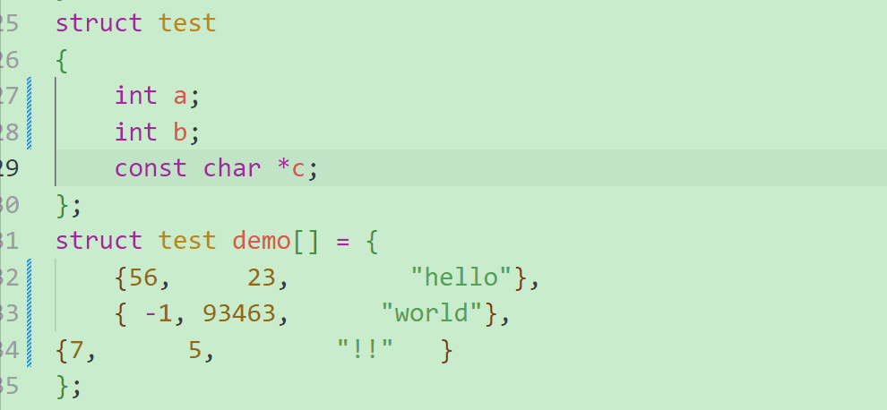
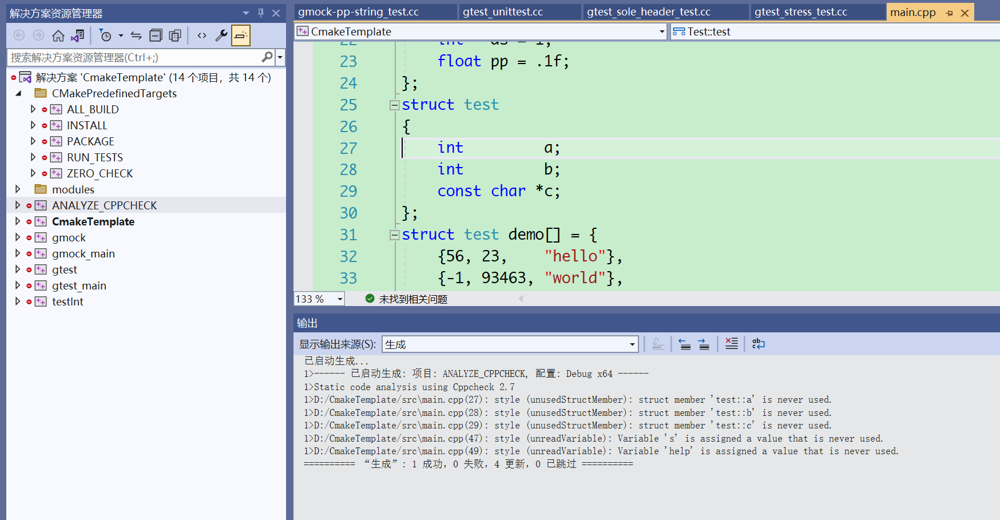

# CMakeTemplate

[TOC]

目录机构:

├─doc<br>
│&emsp;└─img<br>
├─modules<br>
│&emsp;├─log<br>
│&emsp;└─math<br>
├─src<br>
├─test<br>
│&emsp;└─testInt<br>
└─ThirdParty<br>
&emsp;&emsp;└─googletest<br>
&emsp;&emsp;&emsp;├─googlemock<br>
&emsp;&emsp;&emsp;└─googletest<br>
     


<font size = 3>
这是一个CMake工程的范例!<br>
${CMAKE_BINARY_DIR}/bin - 保存程序的可执行文件<br>
${CMAKE_BINARY_DIR}/lib - 保存编译完成后的链接库文件  
</font>

## 一、依赖库
+ [CppCheck](http://cppcheck.net)
+ [llvm](https://llvm.org/)

## 二、功能
目前支持的模块如下：

- [X] CppCheck
- [ ] ninjia
- [ ] vld
- [ ] valgrind
- [X] CPack
- [X] gTest
- [x] clang-format

## 三、执行CTest
+ 运行CTest的指令
```bash
ctest -C debug
```
<div align=center>

</div>

+ 点击VsCode下方状态栏中的RunCTest
<div align=center>

</div>

## 四、clang-format 代码格式化
<div align=center>

</div>

## 五、CppCheck
<div align=center>

</div>
