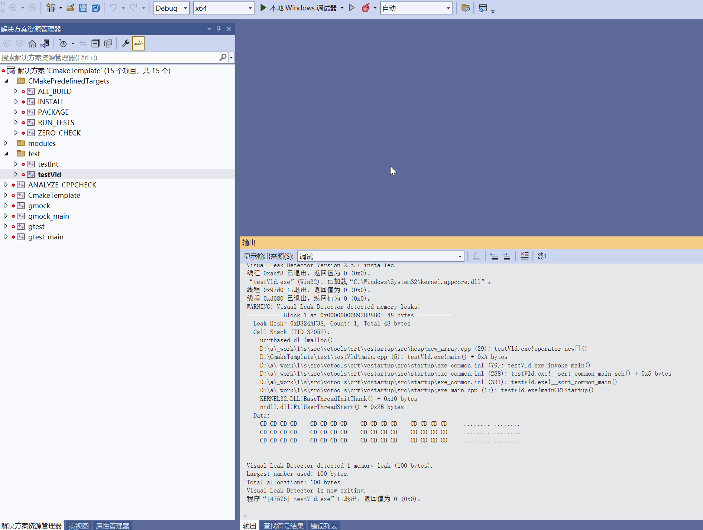

# CMakeTemplate

目录机构:

├─doc<br>
│&emsp;└─img<br>
├─modules<br>
│&emsp;├─log<br>
│&emsp;└─math<br>
├─src<br>
├─test<br>
│&emsp;└─testInt<br>
│&emsp;└─testVld<br>
└─ThirdParty<br>
&emsp;&emsp;├─googletest<br>
&emsp;&emsp;|&emsp;├─googlemock<br>
&emsp;&emsp;|&emsp;└─googletest<br>
&emsp;&emsp;└─vld<br>            


<font size = 3>
这是一个CMake工程的范例!<br>
${CMAKE_BINARY_DIR}/bin - 保存程序的可执行文件<br>
${CMAKE_BINARY_DIR}/lib - 保存编译完成后的链接库文件  
</font>

## 一、依赖库
+ [CppCheck](http://cppcheck.net)
+ [llvm](https://llvm.org/)
+ [CMake 3.22.1](https://cmake.org/)
+ [vs2022](https://visualstudio.microsoft.com/zh-hans/vs/)

## 二、编译步骤
```bash
mkdir build
cd build
cmake ..
cd ..
cmake --build build
```

## 三、功能
目前支持的模块如下：

- [X] CppCheck
- [X] vld
- [ ] valgrind
- [X] CPack
- [X] gTest
- [x] clang-format

## 四、执行CTest
+ 运行CTest的指令
```bash
ctest -C debug
```
<div align=center>

</div>

+ 点击VsCode下方状态栏中的RunCTest
<div align=center>

</div>

## 五、clang-format 代码格式化
<div align=center>

</div>

## 六、CppCheck
<div align=center>

</div>

## 七、vld内存泄漏检测
<div align=center>

</div>


MIT License

Copyright (c) 2022 Zhang Lei

Permission is hereby granted, free of charge, to any person obtaining a copy
of this software and associated documentation files (the "Software"), to deal
in the Software without restriction, including without limitation the rights
to use, copy, modify, merge, publish, distribute, sublicense, and/or sell
copies of the Software, and to permit persons to whom the Software is
furnished to do so, subject to the following conditions:

The above copyright notice and this permission notice shall be included in all
copies or substantial portions of the Software.

THE SOFTWARE IS PROVIDED "AS IS", WITHOUT WARRANTY OF ANY KIND, EXPRESS OR
IMPLIED, INCLUDING BUT NOT LIMITED TO THE WARRANTIES OF MERCHANTABILITY,
FITNESS FOR A PARTICULAR PURPOSE AND NONINFRINGEMENT. IN NO EVENT SHALL THE
AUTHORS OR COPYRIGHT HOLDERS BE LIABLE FOR ANY CLAIM, DAMAGES OR OTHER
LIABILITY, WHETHER IN AN ACTION OF CONTRACT, TORT OR OTHERWISE, ARISING FROM,
OUT OF OR IN CONNECTION WITH THE SOFTWARE OR THE USE OR OTHER DEALINGS IN THE
SOFTWARE.

